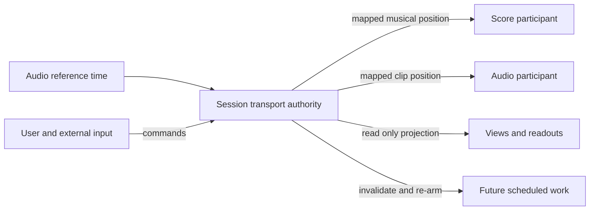

# Logic, interaction, and visual design principles

> Current design principles. This document owns cross-component experience constraints; source and component reference pages own public members. Implementation or verification gaps belong in [STATUS](STATUS.md). A principle is not a claim that every component has passed acceptance.

## 1. Organize capabilities around musical intent

Start with a user's task: play music, enter notes, inspect structure, change a parameter, or compare analysis results. A new tag or presenter should introduce an independent workflow, data/lifecycle contract, or reusable interaction. Prefer configuration or composition when the difference is a fixed type, color, or wrapper.

An independently usable component has a complete usage path. A declaration or companion can share its workflow's page: rack-part belongs with rack-control, and score-recorder shares note-input's recording workflow. Every tag still has one documented owner and a real contract.

## 2. Give data, behavior, and presentation clear authority

Models represent musical material. Headless objects own behavior and session state. Presenters read caller-supplied bindings and issue commands. Elements compose those parts into browser tags. A visible value should be traceable to one state owner; repainting does not create another copy of playback truth.

Use functions for explicit input/output operations and stateful objects for starting, stopping, subscriptions, and disposal. UI does not own audio devices or introduce another scheduler because it displays a Play button. Animation frames may drive drawing and readouts, but are not independent musical clocks.

Analyze and View should support optional playback connections while retaining
standalone use with explicit inputs. A connected follower borrows musical data,
the current state snapshot, and mapped time from the playback authority; its
own analysis or presentation state does not become another transport. The
[player binding design](design/PLAYER-BINDING.md) owns source precedence, readiness,
observation, permitted commands, and connection lifecycle. This is a design
target; each public reference must identify the behavior actually implemented.

## 3. Time is a cross-component protocol

One session authority organizes play, pause, seek, rate, and loop. Score positions, audio seconds/samples, and device time have explicit mappings and units. A visual playhead projects musical time; scrolling, zooming, and highlighting must not implicitly rewrite playback intent.

Content position is stable under playback-rate changes. A session may coordinate
participants with different local positions and loop phases; shared authority does
not require identical content coordinates. New commands use explicit units and
report their committed, superseded or failed outcome.

Changing time, rate, or loop can invalidate future scheduled work. The design must explain cancellation, rescheduling, and rejoining. Sharing an object reference does not replace those protocols. [Architecture](ARCHITECTURE.md) and [Shared-clock injection](../platform/shared-clock-injection.md) own the details.

The following is the accepted session design, rather than a claim that all
engines already share one injected clock instance:

Static scores, clips, and analysis results remain data. A component joins this
timing relationship when it participates in the running session.

## 4. Make actions observable

Every control corresponds to a parameter or command with a visible value, unit, range, and applicable mode. Async operations distinguish request acceptance, loading, actual start, failure, and stopping. An obsolete Promise must not restart a stopped operation. Command failure follows the declared error channel instead of leaving a successful-looking UI over failed sound.

Continuous input and discrete actions have distinct semantics. Every note-on has a release path. Pointer cancellation, blur, disconnection, data replacement, disposal, and multiple simultaneous instances are part of interaction design.

## 5. Accessibility is an interaction contract

Define keyboard operation, visible focus, semantic labels, state readouts, and sensible focus order for the supported interaction. Color is supplemented by text, shape, or position. Canvas/SVG surfaces need an operable semantic entry point.

Parameter controls specify steps, fine adjustment, bounds, and units. Notes, ranges, mixing, and two-dimensional surfaces each explain their keyboard model. Replacing visuals requires rechecking usability. Callers choosing stylesheet:false must provide focus and state styling that inline declarations cannot express. These are acceptance requirements, not a claim of a completed library-wide accessibility/device audit.

## 6. Visuals explain musical relationships

Notation, waveforms, timelines, and spectra are primary information. Containers, borders, headings, and status surfaces provide orientation without burying the musical surface in nested panels. Time direction, pitch/frequency, intensity, selection, playheads, and voices use stable visual encodings. Related views preserve identity for the same musical object.

Keep units clear and numeric readouts easy to compare. Distinguish selected, playing, muted, disabled, loading, and failed states. Density follows the task: compact desktop workflows and touch interaction need deliberate target sizes, spacing, and responsive behavior, rather than one fixed card layout.

## 7. Usable defaults, replaceable expression

Presenters supply default structure and styling needed for their interaction. Applications customize through public --wm-* semantic tokens, parts, and named handle accessors, then may replace a surface, renderer, or entire UI. Internal --wui-* values, implementation class names, and node order are not automatically public contracts.

Disabling stylesheet installation does not disable state machines, bindings, keyboard logic, or cleanup. A compound presenter propagates its styling choice to children it owns. Compatibility token precedence and entry-specific options are documented in the [UI package](../packages/ui/README.md), [style source](../packages/ui/src/styles.ts), and individual presenter pages.

Usable defaults do not impose one brand. A workstation may need dense controls; an installation may need one visual surface mapped to sound. They reuse interaction and timing contracts while expressing different aesthetics.

## 8. Demos are inspectable working examples

Use real components and data. Every exposed parameter is operable in the control strip, or explains why the current input or mode makes its effect invisible. Code readouts match the live configuration. Empty, loading, failed, and disposed states remain understandable.

A beginner route starts with a dependable audible and visible result, including
all required dependencies and the gesture that starts sound. Headless and API + UI
examples demonstrate the same task with different ownership of presentation.
Cross-domain reference compositions exercise replacement, late attachment,
seek/rate/loop and cleanup through public contracts.

LiveDemoCanvas, its grid and Live label, parameter panels, and Copy/Reset are documentation chrome. They are not mandatory package UI or application design. [Site architecture](docs/DOCS-SITE-PLAN.md) and the page templates own demo presentation; [Component design](design/COMPONENT-DESIGN.md) owns the capability being demonstrated.

## 9. Make resources and failure boundaries explicit

Borrowed contexts, players, streams, workers, renderers, and models are not disposed merely because a UI disappears. Owned resources have a release path. Partial construction failure rolls back acquired resources. Reentrancy, concurrent requests, data replacement, and stopping during an await require explicit operation identity or invalidation semantics.

Resource adapters declare capabilities, formats, precision, dependencies, environments, and cleanup. Analysis can be absent or uncertain; the UI reflects the actual source and readiness instead of presenting zero as completed analysis. Synchronization, transcription, offline rendering, and realtime playback state their own limits.

## 10. Extend through contracts and evidence

Before introducing a capability, check whether an existing model, API, Headless object, presenter, or driver can express it. Record shared decisions in [DECISIONS](DECISIONS.md) and use the component template for acceptance scenarios. Automated checks cover mechanical contracts; browsers, sound, and devices verify user outcomes. Neither substitutes for the other.
